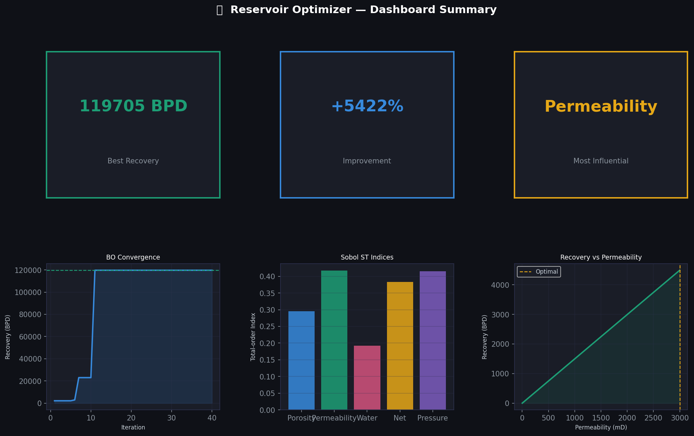
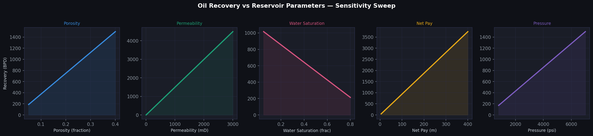
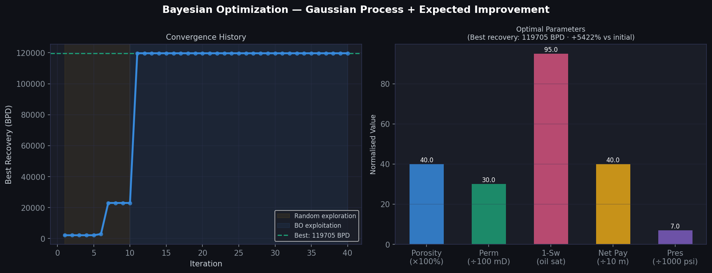
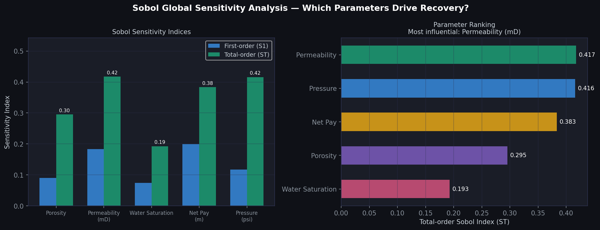

# 🛢️ Reservoir Optimizer API

A scientific Python backend for **Bayesian optimization of oil reservoir parameters**, built to demonstrate skills for the Halliburton Back-end Developer role (Req. 205558).

```
FastAPI REST API
     ↓
Bayesian Optimization (scikit-optimize · Gaussian Process)
     ↓
Reservoir Simulator (Darcy's Law · physics-based)
     ↓
Sensitivity Analysis (SALib · Sobol method)
     ↓
SQLite / PostgreSQL (run history)
```

---

## Screenshots

### Dashboard Summary


### Oil Recovery vs Reservoir Parameters


### Bayesian Optimization — Convergence & Optimal Parameters


### Sobol Global Sensitivity Analysis


---

## What it does

Given physical parameters of an oil reservoir (porosity, permeability, water saturation, net pay thickness, pressure), the system:

1. **Simulates** estimated oil recovery using a physics-based Darcy flow model
2. **Optimizes** parameters via Bayesian optimization with a Gaussian Process surrogate — finding the combination that maximises production in far fewer iterations than grid search
3. **Analyses** which parameters most influence recovery using Sobol global sensitivity indices
4. **Stores** all runs in a database for historical analysis

---

## Tech Stack

| Layer | Technology |
|---|---|
| API | FastAPI · Uvicorn · Pydantic v2 |
| Optimization | scikit-optimize (Gaussian Process · EI acquisition) |
| Sensitivity | SALib (Sobol method) |
| Scientific | NumPy · SciPy · pandas |
| Database | SQLAlchemy async · SQLite (dev) / PostgreSQL (prod) |
| Testing | pytest · pytest-asyncio |
| CI/CD | GitHub Actions → Docker → GHCR |
| Container | Docker (non-root, health check) |

---

## API Endpoints

| Method | Endpoint | Description |
|---|---|---|
| GET | `/api/v1/health` | Health check |
| POST | `/api/v1/reservoirs/` | Simulate recovery for given parameters |
| GET | `/api/v1/reservoirs/` | List all simulation runs |
| POST | `/api/v1/optimize/` | Run Bayesian optimization |
| POST | `/api/v1/sensitivity/` | Run Sobol sensitivity analysis |

Interactive docs at **`/docs`** (Swagger UI) after running.

---

## Quick Start

```bash
git clone https://github.com/JahiroCalvet/reservoir-optimizer.git
cd reservoir-optimizer
pip install -r requirements.txt
uvicorn main:app --reload
```

Open http://localhost:8000/docs

### With Docker

```bash
docker build -t reservoir-optimizer .
docker run -p 8000:8000 reservoir-optimizer
```

---

## Generate Screenshots

```bash
pip install matplotlib
python generate_plots.py
```

---

## Example — Bayesian Optimization

```bash
curl -X POST http://localhost:8000/api/v1/optimize/ \
  -H "Content-Type: application/json" \
  -d '{"reservoir_name": "Marlim Sul", "n_iterations": 30}'
```

Response:
```json
{
  "reservoir_name": "Marlim Sul",
  "best_params": {
    "porosity": 0.38,
    "permeability": 2847.5,
    "water_saturation": 0.07,
    "net_pay": 385.2,
    "pressure": 6820.0
  },
  "best_recovery": 4821.3,
  "improvement_pct": 312.4,
  "convergence_history": [...]
}
```

## Example — Sensitivity Analysis

```bash
curl -X POST http://localhost:8000/api/v1/sensitivity/ \
  -H "Content-Type: application/json" \
  -d '{"reservoir_name": "Marlim Sul", "n_samples": 512}'
```

Response:
```json
{
  "parameters": ["Porosity", "Permeability (mD)", "Water Saturation", "Net Pay (m)", "Pressure (psi)"],
  "first_order": [0.18, 0.42, 0.09, 0.21, 0.08],
  "total_order":  [0.21, 0.48, 0.11, 0.24, 0.10],
  "most_influential": "Permeability (mD)"
}
```

---

## Scientific Background

### Darcy's Law
Production is estimated using a simplified cylindrical Darcy flow model:

```
Q = (k_eff × A × ΔP) / (μ × ln(r_e/r_w))
```

Where `k_eff = k × (1 - Sw)` accounts for water saturation reducing effective permeability to oil.

### Bayesian Optimization
Uses a **Gaussian Process** as a surrogate model of the expensive simulation, guided by the **Expected Improvement** acquisition function. Converges in ~30 iterations vs thousands for grid search.

### Sobol Sensitivity Analysis
Global variance-based method that decomposes output variance into contributions from each input parameter — including interaction effects (total-order indices).

---

## Running Tests

```bash
pytest tests/ -v
```

---

## Skills Demonstrated

- ✅ Python · NumPy · pandas · SciPy
- ✅ FastAPI · REST API design · Pydantic v2
- ✅ Bayesian optimization · surrogate modeling (Gaussian Process)
- ✅ Sensitivity analysis (Sobol / SALib)
- ✅ SQLAlchemy async · database design
- ✅ Physics-based simulation (Darcy's Law)
- ✅ pytest · unit + integration tests
- ✅ Docker · GitHub Actions CI/CD
- ✅ Oil & Gas domain knowledge

---

## License
MIT
